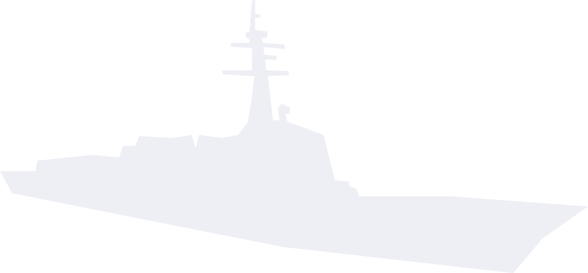
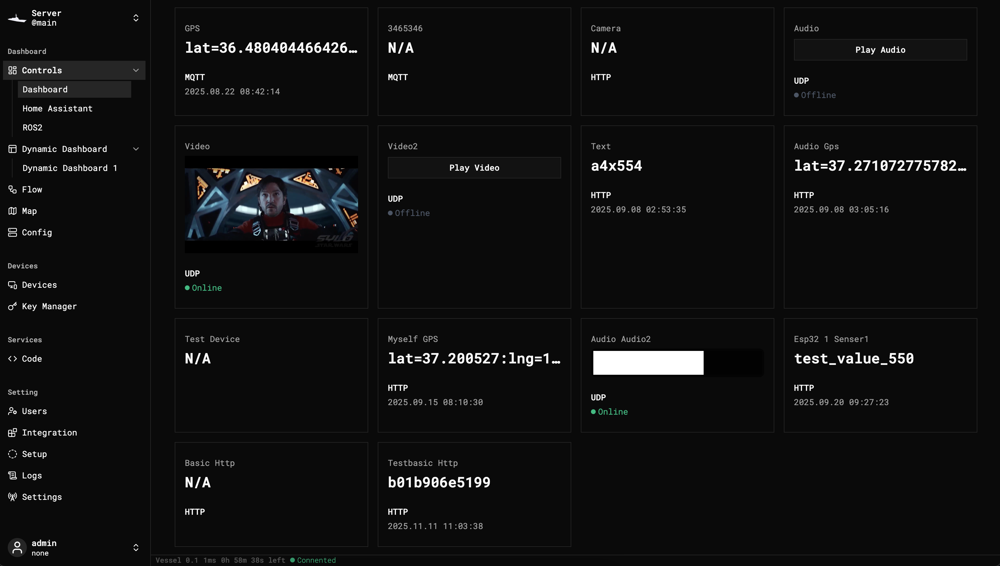

<p align='center'>

<h1 align='center'>Vessel</h1>
<p align='center'>Physical Device Orchestration Platform for Home Protection</p>
</p>

<p align='center'>
<a href="https://github.com/cartesiancs/vessel/blob/main/LICENSE"></a>
<a href="https://github.com/cartesiancs/vessel/stargazers"></a>
<a href="https://github.com/cartesiancs/vessel/issues"></a>
</p>

<p align='center'>
<a href="https://vessel.cartesiancs.com/">Visit Website</a> · <a href="https://github.com/cartesiancs/vessel/issues">Report Bugs</a> · <a href="https://vessel.cartesiancs.com/docs/introduction">Docs</a>
</p>

## About The Project



Vessel is the C2 (Command & Control) software. It empowers you to connect, monitor, and orchestrate a wide array of physical sensors through an intuitive, visual flow-based interface.

Instead of relying on passive, closed-off security systems, Vessel gives you the tools to build a proactive and highly customized defense system for your personal assets—be it your home, workshop, or small farm.

(flow image)

## Features

- Connect all sensers (MQTT, RTP, RTSP)
-

## Develop

Get your local copy up and running.

#### Prerequisites

- [Rust](https://www.rust-lang.org/) & Cargo
- [Node.js](https://nodejs.org/en/) (v18+) and npm

#### 1. Server Setup

```bash
# 1. Clone the repository
git clone https://github.com/cartesiancs/vessel.git
cd vessel/apps/server

# 2. Copy and configure environment variables
cp .env.example .env
# nano .env (Modify if needed)

# 3. Run database migrations
diesel setup
diesel migration run

# 4. Run the server
cargo run
```

#### 2. Client Setup

Bash

```bash
# 1. Install dependencies
npm install

# 2. Run the development server
npm run client
```

## Compile

...

## Contributing

Contributions are what make the open source community such an amazing place to learn, inspire, and create. Any contributions you make are greatly appreciated.

Please refer to our [CONTRIBUTING.md](CONTRIBUTING.md) for details.

## License

Distributed under the Apache-2.0 License. See [LICENSE](LICENSE) for more information.
