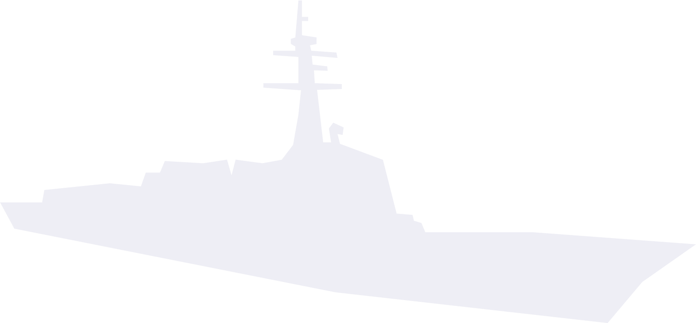
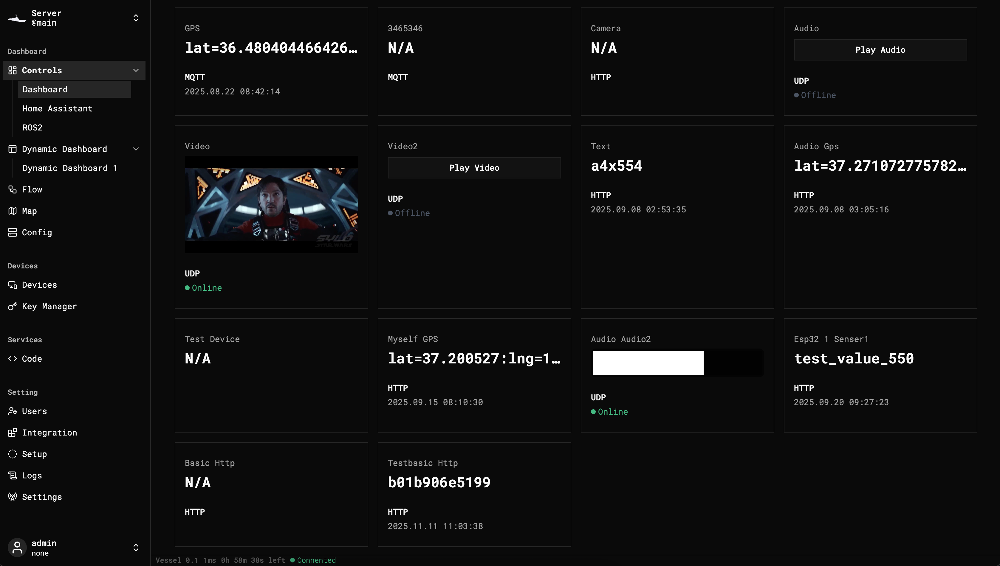

<p align='center'>

<h1 align='center'>Vessel</h1>

<p align='center'>
<a href="https://github.com/cartesiancs/vessel/blob/main/LICENSE"></a>
<a href="https://github.com/cartesiancs/vessel/stargazers"></a>
<a href="https://github.com/cartesiancs/vessel/issues"></a>
<a href="https://vessel.cartesiancs.com/"></a>
<a href="https://vessel.cartesiancs.com/docs/introduction"></a>
</p>

<p align='center'>
<a href="https://vessel.cartesiancs.com/">Visit Website</a> · <a href="https://github.com/cartesiancs/vessel/issues">Report Bugs</a> · <a href="https://vessel.cartesiancs.com/docs/introduction">Docs</a> · <a href="https://vsl.cartesiancs.com/">App</a>
</p>

## About The Project



Vessel is the **C2 (Command & Control) software** for connecting, monitoring, and orchestrating arrays of physical sensors via an intuitive, visual flow-based interface.

This project is to build a "proactive security system". To achieve this, the following three functions are necessary:

1. **Connect** to Physical Device
2. **Detect** Threats
3. **Control** and Respond

This project solves the problems with existing **home security systems**. Current systems fail to protect against burglaries, trespassing, theft and even war.

So we plan to open-source the technology used in existing defense systems.

This system allows you to analyze video and audio sources with AI/ML technology.

And automate actions through Flow-based operations. The Flow provides the flexibility to select multiple AI models and connect them directly to stream sources.

When everything is implemented, individuals will be able to protect themselves from any threats.

> [!NOTE]
> 🚧 <strong>This project is under active development.</strong> Some features may be unstable or subject to change without notice.

## Features

- Connect all sensers (MQTT, RTP, RTSP, HTTP, ...)
- RTP Audio & Video Streaming
- RTSP Video Streaming
- Real-time streaming support
- Flow Visual Logic
- Custom Script Language Support
- Pub/Sub MQTT with Flow
- Map based UI
- Home Assistant Integration
- ROS2 Integration
- External access support
- Capsule (Zero-Knowledge LLM Call) security.
- Local-first design, Offline-first design.

## Develop

Get your local copy up and running.

#### Prerequisites

- [Rust](https://www.rust-lang.org/) & Cargo
- [Node.js](https://nodejs.org/en/) (v18+) and npm
- [gstreamer](https://gstreamer.freedesktop.org/documentation/rust/git/docs/gstreamer/index.html)
- [mosquitto (MQTT)](https://mosquitto.org/) (additional)

### Option1. Run normally

##### 1. Server Setup

```bash
# 1. Clone the repository
git clone https://github.com/cartesiancs/vessel.git
cd vessel/apps/server

# 2. Copy and configure environment variables
cp .env.example .env
# nano .env (Modify if needed)

# 3. Run database migrations
diesel setup
diesel migration run

# 4. Run the server
cargo run
```

##### 2. Client Setup

```bash
# 1. Install dependencies
npm install

# 2. Run the development server
npm run client
```

### Option2. Run Docker

```bash
docker build -t server .

docker run -p 0.0.0.0:6174:6174 server:latest
```

### Option3. Desktop (Tauri)

```bash
npm run desktop
```

Builds the Rust server sidecar in release mode, starts the Vite dev server for the client, and launches the Tauri shell. For a packaged build use `npm run desktop:build`.

## Compile

This command compiles the entire project, including both the server and the client, into a single executable file.

```bash
npm run build
```

The compiled binary, named 'server', will be located in the target/release directory.

> To run the server executable, you must have a .env file in the same directory (target/release).

## Principles

1. Local-first
2. Offline-first
3. Ultimate control rests with the user

## Troubleshooting

> A more detailed troubleshooting guide will be available soon.

## Roadmap

Please visit our Roadmap page below:

[Roadmap Page >](https://vessel.cartesiancs.com/roadmap)

## Contributing

Contributions are what make the open source community such an amazing place to learn, inspire, and create. Any contributions you make are greatly appreciated.

Please refer to our [CONTRIBUTING.md](CONTRIBUTING.md) for details.

## Contributors

 <a href = "https://github.com/cartesiancs/vessel/graphs/contributors">
   
 </a>

## License

Distributed under the Apache-2.0 License. See [LICENSE](LICENSE) for more information.

## Disclaimer

This project is intended for academic and research purposes only. It is designed to facilitate the connection and control of physical devices. All responsibility for its use lies with the user.
